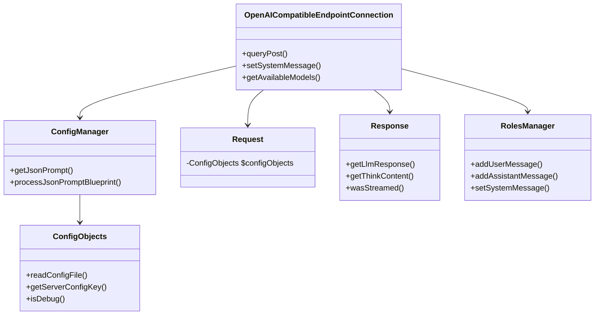

# Viceroy LLM Library

## Table of Contents
1. [Introduction](#introduction)
2. [Architecture Diagram](#architecture-diagram)
3. [Core Components](#core-components)
   - [Configuration Management](#configuration-management)
   - [Connection Handling](#connection-handling)
   - [Request/Response Handling](#requestresponse-handling)
   - [Conversation Management](#conversation-management)
4. [Usage Example](#usage-example)
5. [Key Features](#key-features)
6. [Class Relationships](#class-relationships)
7. [Configuration Details](#configuration-details)
8. [Advanced Features](#advanced-features)
9. [Troubleshooting](#troubleshooting)
10. [Example Files](#example-files)

## Introduction
Viceroy provides a PHP framework for interacting with OpenAI-compatible LLM APIs. The library handles configuration management, API communication, conversation state, and response processing.


## Installation

To integrate the Viceroy LLM Library into your project, you can use Composer. Run the following command in your project directory:

```bash
composer require viceroy/llm-library
```


## Architecture Diagram


## Core Components

### 1. Configuration Management
#### **ConfigObjects.php**
- Manages configuration data from JSON files
- Key methods:
  - `readConfigFile()`: Loads configuration from file
  - `getServerConfigKey()`: Gets server-specific config values
  - `isDebug()`: Checks debug mode status

#### **ConfigManager.php**
- Processes JSON prompts and parameters
- Key methods:
  - `getJsonPrompt()`: Retrieves processed prompt content
  - `processJsonPromptBlueprint()`: Prepares prompt structure

### 2. Connection Handling
#### **OpenAICompatibleEndpointConnection.php**
- Manages API communication via Guzzle
- Key features:
  - Streaming response support
  - Model management
  - Bearer token authentication
- Key methods:
  - `queryPost()`: Sends requests to API
  - `setSystemMessage()`: Sets initial context
  - `getAvailableModels()`: Lists available models
  - `setParameter()`: Sets LLM parameters (temperature, top_p, etc) with fluent interface

### 3. Request/Response Handling
#### **Request.php**
- Currently minimal implementation holding ConfigObjects reference

#### **Response.php**
- Processes API responses with:
  - Think-tag extraction (`<think>...</think>`)
  - Streaming support
  - Error handling
- Key methods:
  - `getLlmResponse()`: Gets processed response content
  - `getThinkContent()`: Extracts think-tag content
  - `wasStreamed()`: Checks if response was streamed

### 4. Conversation Management
#### **RolesManager.php**
- Manages message history by role
- Enforces system message as first message
- Key methods:
  - `addUserMessage()`: Adds user prompt
  - `addAssistantMessage()`: Adds LLM response
  - `setSystemMessage()`: Sets system context
  - `clearMessages()`: Resets conversation

## Usage Example
```php
// Initialize configuration
$config = new ConfigObjects('config.json');
$configManager = new ConfigManager($config);

// Create connection
$connection = new OpenAICompatibleEndpointConnection($config);
$connection->setSystemMessage("You are a helpful assistant.")
    ->setParameter('temperature', 0.7)
    ->setParameter('top_p', 0.9);

// Send query
$response = $connection->query("Explain quantum physics");

// Handle response
if ($response->wasStreamed()) {
    echo "Streamed response received";
} else {
    echo $response->getLlmResponse();
    echo "\nThink content: " . $response->getThinkContent();
}
```

## Key Features
- **Streaming Support**: Real-time processing of LLM responses
- **Think-Tag Processing**: Extracts and processes `<think>` tags from responses
- **Conversation State**: Maintains context across multiple messages
- **Configuration**: Flexible JSON-based configuration

## Class Relationships
1. ConfigManager uses ConfigObjects for configuration storage
2. OpenAICompatibleEndpointConnection coordinates:
   - ConfigManager for parameters
   - Request for request handling
   - Response for processing outputs
   - RolesManager for conversation state
3. Response processes data from OpenAICompatibleEndpointConnection

## Configuration Details
Configuration is managed via JSON files. The `config.json` file is the primary configuration file. Here is an example of what the `config.json` might look like:

```json
{
  "server": {
    "url": "https://api.openai.com/v1",
    "bearer_token": "your-bearer-token"
  },
  "debug": true,
  "models": {
    "default": "gpt4-o"
  }
}
```

## Advanced Features
- **Custom Parameters**: You can set custom parameters for the LLM using the `setParameter()` method.
- **Fluent Interface**: Methods like `setParameter()` return the object itself, allowing for method chaining.
- **Error Handling**: The library includes robust error handling for API requests and response processing.

## Troubleshooting
- **API Errors**: Ensure that your bearer token is correct and that the API URL is accessible.
- **Configuration Issues**: Verify that your `config.json` file is correctly formatted and contains all necessary fields.
- **Debug Mode**: Enable debug mode in the configuration to get more detailed logs and error messages.

## Example Files
The `examples` directory contains several PHP scripts demonstrating different usage scenarios:
- `benchmark_multi.php`: Demonstrates sending multiple queries in a loop.
- `benchmark_simple.php`: Demonstrates a simple query.
- `chat_sample.php`: Demonstrates a basic chat interaction.
- `config.localhost.json`: Example configuration for local development.
- `config.openai.json`: Example configuration for OpenAI API.
- `query_llamacpp.php`: Example using a different LLM provider.
- `roles_llamacpp.php`: Example managing roles with a different LLM provider.
- `self_defined_functions_poc.php`: Example of using self-defined functions.
- `simple_query_llamacpp.php`: Simple query example with a different LLM provider.
- `stream_realtime_example.php`: Example of streaming responses in real-time.


## Installation

To integrate the Viceroy LLM Library into your project, you can use Composer. Run the following command in your project directory:

```bash
composer require viceroy/llm-library
```
