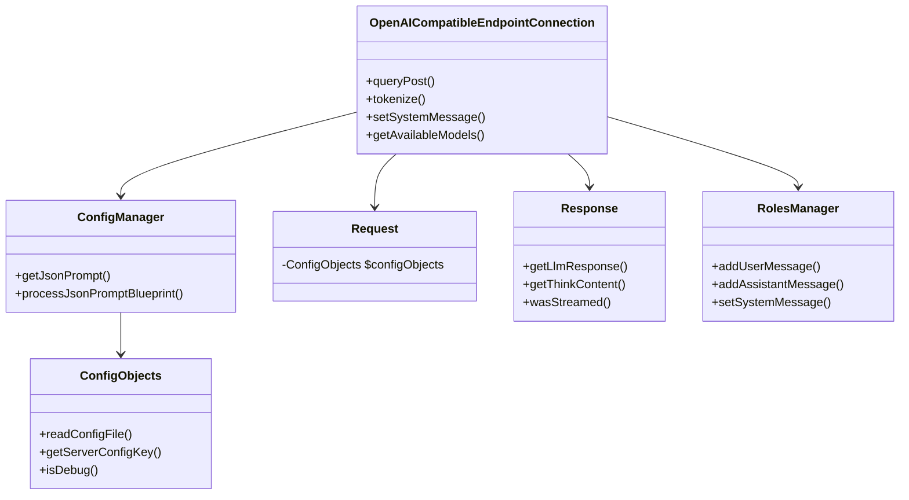

# Project Description: Viceroy LLM Library

## Overview
Viceroy provides a PHP framework for interacting with OpenAI-compatible LLM APIs. The library handles configuration management, API communication, conversation state, and response processing.

## Architecture Diagram


## Core Components

### 1. Configuration Management
#### **ConfigObjects.php**
- Manages configuration data from JSON files
- Key methods:
  - `readConfigFile()`: Loads configuration from file
  - `getServerConfigKey()`: Gets server-specific config values
  - `isDebug()`: Checks debug mode status

#### **ConfigManager.php**
- Processes JSON prompts and parameters
- Key methods:
  - `getJsonPrompt()`: Retrieves processed prompt content
  - `processJsonPromptBlueprint()`: Prepares prompt structure

### 2. Connection Handling
#### **OpenAICompatibleEndpointConnection.php**
- Manages API communication via Guzzle
- Key features:
  - Streaming response support
  - Tokenization/detokenization
  - Model management
  - Bearer token authentication
- Key methods:
  - `queryPost()`: Sends requests to API
  - `tokenize()`: Tokenizes input text
    - `setSystemMessage()`: Sets initial context
    - `getAvailableModels()`: Lists available models
    - `setParameter()`: Sets LLM parameters (temperature, top_p, etc) with fluent interface

### 3. Request/Response Handling
#### **Request.php**
- Currently minimal implementation holding ConfigObjects reference

#### **Response.php**
- Processes API responses with:
  - Think-tag extraction (`<think>...</think>`)
  - Streaming support
  - Error handling
- Key methods:
  - `getLlmResponse()`: Gets processed response content
  - `getThinkContent()`: Extracts think-tag content
  - `wasStreamed()`: Checks if response was streamed

### 4. Conversation Management
#### **RolesManager.php**
- Manages message history by role
- Enforces system message as first message
- Key methods:
  - `addUserMessage()`: Adds user prompt
  - `addAssistantMessage()`: Adds LLM response
  - `setSystemMessage()`: Sets system context
  - `clearMessages()`: Resets conversation

## Usage Example
```php
// Initialize configuration
$config = new ConfigObjects('config.json');
$configManager = new ConfigManager($config);

// Create connection
$connection = new OpenAICompatibleEndpointConnection($config);
$connection->setSystemMessage("You are a helpful assistant.")
    ->setParameter('temperature', 0.7)
    ->setParameter('top_p', 0.9);

// Send query
$response = $connection->query("Explain quantum physics");

// Handle response
if ($response->wasStreamed()) {
    echo "Streamed response received";
} else {
    echo $response->getLlmResponse();
    echo "\nThink content: " . $response->getThinkContent();
}
```

## Key Features
- **Streaming Support**: Real-time processing of LLM responses
- **Think-Tag Processing**: Extracts and processes `<think>` tags from responses
- **Tokenization**: Built-in text tokenization/detokenization
- **Conversation State**: Maintains context across multiple messages
- **Configuration**: Flexible JSON-based configuration

## Class Relationships
1. ConfigManager uses ConfigObjects for configuration storage
2. OpenAICompatibleEndpointConnection coordinates:
   - ConfigManager for parameters
   - Request for request handling
   - Response for processing outputs
   - RolesManager for conversation state
3. Response processes data from OpenAICompatibleEndpointConnection
